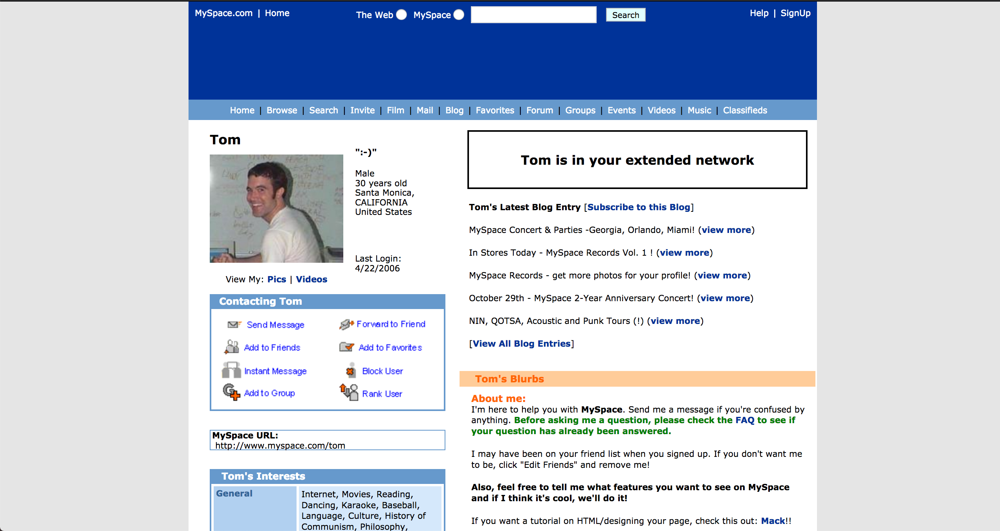

# An unofficial Myspace clone (circa 2002)


An unofficial MySpace clone of the original from 2002 (when social media platforms were actually about friends). This is an open sourced project I decided to do for fun. Myspace (circa 2002) was bootstrapped with the starter Next.js template. To understand how this app works, please refern to [Learn Next.js](https://nextjs.org/learn) before you start.

The original styles and layout was originally forked from [wittenbrocks tom-myspace-page](https://wittenbrock.github.io/toms-myspace-page). Please send him some love.


## Installation

Fork the repository then clone it to your own machine in a directory you will remember. Then `cd` into it to install dependencies with `npm`

```bash
git clone git@github.com:benji011/myspace_nextjs.git
cd myspace_nextjs
npm install

```

## Running locally
Just run the below command and open `localhost:3000` in your browser

```bash
npm run dev
```



## Current progress
I created a [kanban board](https://github.com/benji011/myspace_nextjs/projects/1) in order to manage this project. If you're interested in getting involved, please go ahead and click here to view the todos and get started. Or, you are welcome to create an issue/task and get involved straight away :)


## Current version
You can view the current release that's in progress, marked as todo or past releases in this [kanban board](https://github.com/users/benji011/projects/1).


## Contributing
Pull requests are welcome. For major changes, please open an issue first to discuss what you would like to change.

Please make sure to update tests as appropriate.

## Contact
- [Benjamin Lo](https://github.com/benji011)

## License
[MIT](https://choosealicense.com/licenses/mit/)